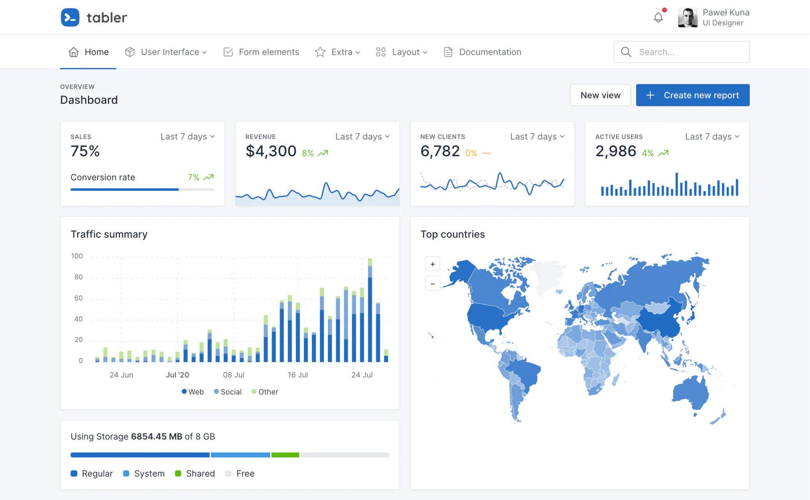

<h1 align="center">
React UI Components Based on
<p align="center"><a href="https://tabler.io/"></a></p>
</h1>

Tabler is a free and open source web application UI kit based on Bootstrap 5, with hundreds responsive components and multiple layouts.
This package is ui components version of beautiful and simple Tabler library developed to use in ReactJS framework. Every component of the package uses the base [@tabler/core](https://www.npmjs.com/package/@tabler/core) and [@tabler/icons-react](https://www.npmjs.com/package/@tabler/icons-react) library to make easy-to-use and React based set of components.

To view documentation of components and its usage please visit [Storybook](https://63ed4f4ac6361e5b507cf5a5-xrcjjfcakx.chromatic.com/) of tabler-react-components published in chromatic.



[](https://www.npmjs.com/package/tabler-react-components)

## 🖥 Environment Support

- Modern browsers
- Server-side Rendering

| [](http://godban.github.io/browsers-support-badges/)<br>Edge | [](http://godban.github.io/browsers-support-badges/)<br>Firefox | [](http://godban.github.io/browsers-support-badges/)<br>Chrome | [](http://godban.github.io/browsers-support-badges/)<br>Safari |
| --- | --- | --- | --- |
| Edge | last 2 versions | last 2 versions | last 2 versions |

## 📦 Installation

To install the React Pagination UI Component Library, you can use npm or yarn:

```bash
npm install tabler-react-components
```

or

```bash
yarn add tabler-react-components
```

## 🔨 Usage

```jsx
import * as React from 'react'

import { TablerProvider } from 'tabler-react-components'

function App() {
  // Wrap TablerProvider at the root of your app component
  return (
    <TablerProvider>
      <TheRestOfYourApplication />
    </TablerProvider>
  )
}
```

## 🔗 Links

- [Storybook page](https://63ed4f4ac6361e5b507cf5a5-xrcjjfcakx.chromatic.com/)
- [Tabler](https://tabler.io/)
- [Tabler Github](https://github.com/tabler/tabler)
